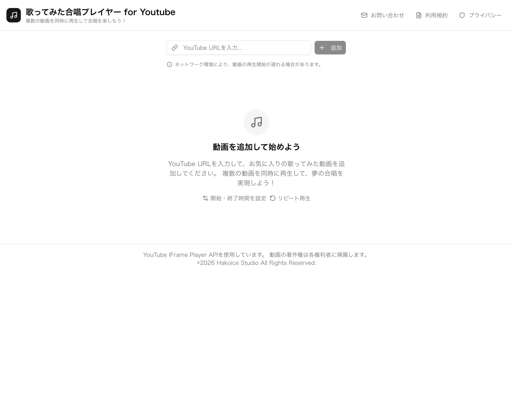
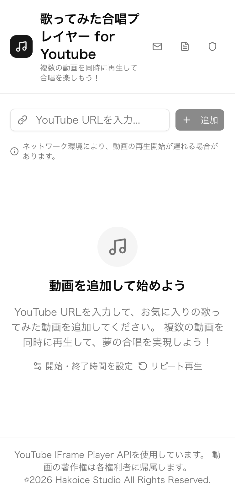
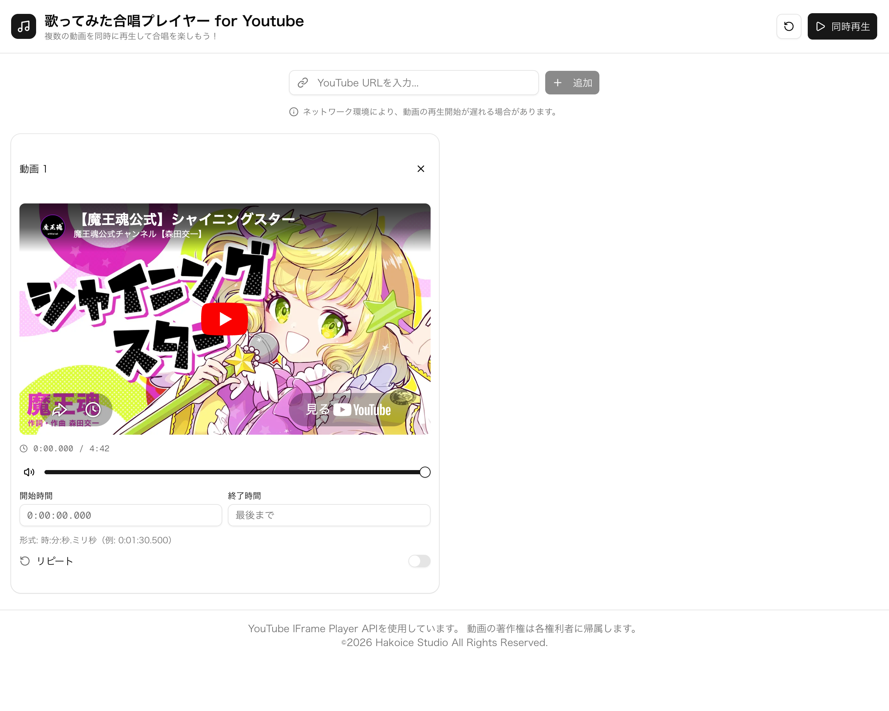
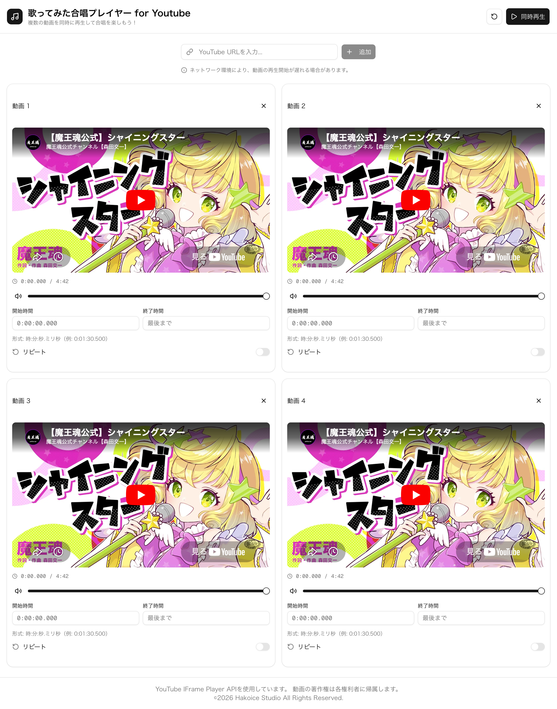
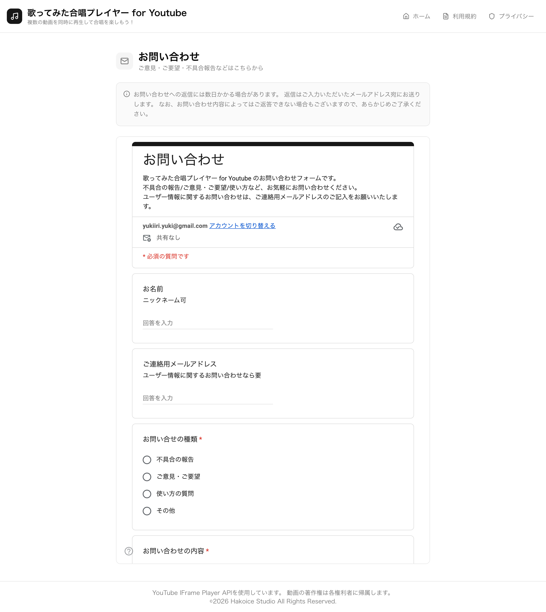
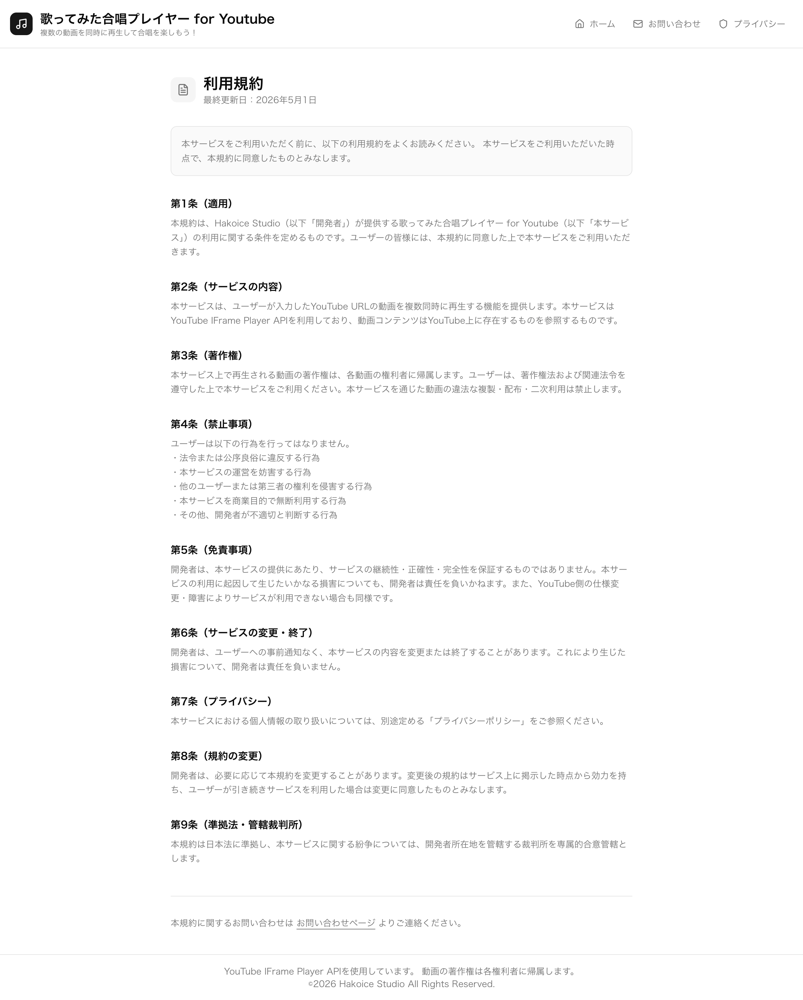
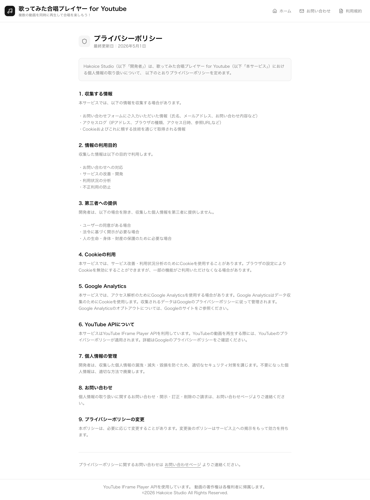
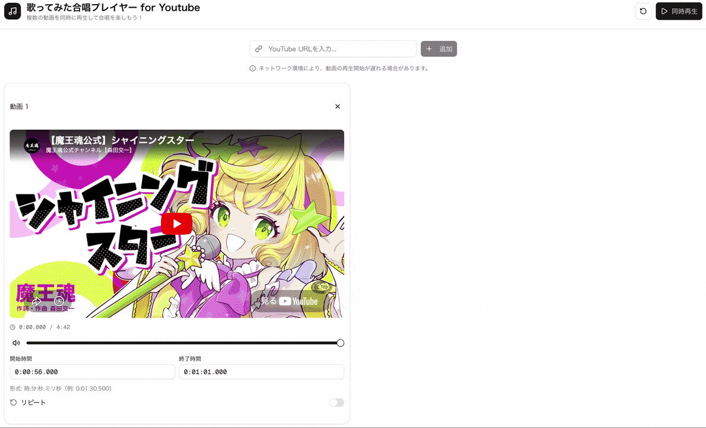
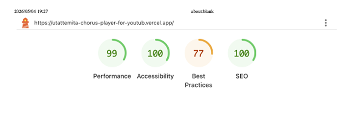
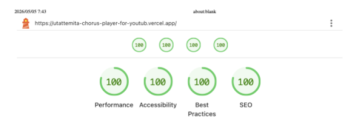

# 【重要】Youtube API の利用規約にて、1ページで複数のプレイヤーを再生することが禁止されていることを確認したため、サービスを停止！！

## スクリーンショット

<!-- 登録、ログイン、マイページ、マイセット、ソーシャル、アカウント削除、利用規約、プライバシーポリシー、問い合わせ、404 etc -->

| ホーム画面 |
| - |
|  |

ホーム - デスクトップ/モバイル

| デスクトップ | モバイル |
| - | - |
|  |  |

動画追加 - 1件

| 動画追加 - 1件 |
| - |
|  |

動画追加 - 4件

| 動画追加 - 4件 |
| - |
|  |

お問い合わせ・利用規約

| お問い合わせ | 利用規約 |
| - | - |
|  |  |

プライバシーポリシー

| プライバシーポリシー |  |
| - | - |
|  |  |

## 使用技術一覧

  <!-- フレームワーク、ライブラリ、データベース、CI/CD、インフラ一覧 -->
  
  
  
  
  
  
  
  
  
  
  
  

## 開発期間

2026.05.01 〜 2026.05.07（7日間） 
制作人数 1人 

## 目次

1. [開発のきっかけ](#開発のきっかけ)
2. [プロジェクトについて](#プロジェクトについて)
3. [動作確認](#動作確認)
4. [環境](#環境)
5. [技術選定理由](#技術選定理由)
6. [ER図](#er図)
7. [インフラ構成図](#インフラ構成図)
8. [主な機能](#主な機能)
8. [工夫した点](#工夫した点)
9. [修正点](#修正点)
10. [今後の開発について](#今後の開発について)
11. [AIについて](#aiについて)
12. [その他の作品](#その他の作品)

## 開発のきっかけ

新作の歌ってみた動画を視聴中、間違えて別の歌ってみた動画を再生したことがきっかけでした。 
歌声が重なって聞こえると、普段は感じないような臨場感を味わえて面白いと感じ、サービスの開発を始めました。 

## プロジェクトについて

リンク: [歌ってみた合唱プレイヤー for Youtube](https://utattemita-chorus-player-for-youtub.vercel.app/) 
Youtubeの歌ってみた動画や歌枠のアーカイブを複数同時に再生・停止・リピートさせることができるサービスです。 
好きなアーティストさんや普段は聞かないような方との合唱で思わぬ発見ができるかもしれません。 

## 動作確認

■Webサイトでの動作確認 
リンク: [歌ってみた合唱プレイヤー for Youtube](https://utattemita-chorus-player-for-youtub.vercel.app/)

■ローカルでの動作確認 
1. Docker DesktopやDocker EngineなどDockerを実行できる環境を用意
2. Dockerfileを反映 `docker compose build`
3. Dockerコンテナの起動 `docker compose up -d`
4. ローカルホスト`http://localhost:3000/`上で正常に動作することを確認
5. Dockerコンテナの終了 `docker compose down`

## 環境

<!-- 言語、フレームワーク、データベース、インフラの一覧とバージョンを記載 -->

| フロントエンド | バージョン |
| - | - |
| Next.js | 16.2.4 |
| React | 19.2.4 |
| TypeScript | 5.9.3 |

<!-- バックエンド -->

<!-- データベース -->

<!-- 認証 -->

| 環境構築 | バージョン |
| - | - |
| Docker Desktop | 4.37.2 |
| Docker Engine | 27.4.0 |

| CI/CD | バージョン |
| - | - |
| Github Actions |  |

| インフラ | バージョン    |
| - | - |
| Vercel |  |

| その他 | バージョン |
| - | - |
| Tailwind CSS | 4.2.4 |
| ESLint | 9.39.4 |
| Prettier | 3.8.3 |
| Jest | 30.3.0 |
| shadcn/ui | 2.0.1 |
| @vercel/analytics | 2.0.1 |
| @types/youtube | 0.2.0 |

| デザイン | バージョン    |
| - | - |
| v0 |  |

## 技術選定理由

■フロントエンド 

Next.js

- CSR・SSR・SSG・ISRなどレンダリング方法を複数選択できる

- レンダリング方法次第で、SEOの向上が見込め、検索流入を増やせる

- 暫定的なレンダリング方法でサービスを開始できる（今回はCSRでサービスを開始）

- Metadataのカスタマイズができる リンク: [layout.tsx](https://github.com/yukikomori332/Utattemita-Chorus-Player-for-Youtube/blob/main/front/app/layout.tsx)

- 短い期間で早く開発して、自分がサービスを使いたかった（私情）

React
 

- Next.jsと依存関係があるため

TypeScript

- Next.jsと依存関係があるため

- 型安全により、エラーの早期発見ができる

TailwindCSS
 

- Next.jsと依存関係があるため

 

■CI/CD 

Github Actions
 

- Githubサービス内でCI/CDを完結できる

 

■インフラ 

Vercel

- Next.jsと開発元が同じため、Next.jsのプロジェクトであれば高いパフォーマンスが見込まれる

- GitHubと連携して、プッシュが行われると自動ビルド・デプロイされる

 

■その他 

ESLint
 

- Next.jsと依存関係があるため

Prettier

- Typescriptに対応している

- ESLintと組み合わせることで、高い品質のコードを保てる

Jest

- JavaScript向けのテストフレームワークであること

- スナップショット機能やカバレッジ計測などテストに欠かせない機能が揃っている

shadcn/ui
 

- きれいな見た目のコンポーネントを簡単に実装できる

@vercel/analytics

- Cookieを介さずにWebサイトを解析できる

- 同意を求めるポップアップが不要

@types/youtube
 

- Youtube IFrame API の読み込みに必要

 

■デザイン 

v0
 

- デザインとプログラムの両方で高速にプロトタイプが作成できる

## ER図

実装予定 

<!--   -->

## インフラ構成図

実装予定 

<!--   -->

## 主な機能

音量調整 

開始/終了の時間指定
 

- ミリ秒単位まで開始/終了の時間指定が可能  

| 開始/終了の時間指定 |
| - |
|  |

同期的なリピート
 

- 他の動画の終了を待ってから、リピートを開始する  

| 同期的なリピート |
| - |
|  |

## 工夫した点

Webサイトが初めて読み込まれる時のベンチマークの向上
 

デベロッパーツールのLighthouseでWebサイトの品質（初回読み込み）を調査しました。 
Youtube IFrame APIの読み込み時に、YoutubeサードパーティのCookieがChrome等のブラウザにブロックされるため、警告が出ていました。 
解決策として、Webサイトが初めて読み込まれる時にYoutube IFrame APIの読み込みを行うのではなく、Youtube URL入力時にYoutube IFrame APIの読み込みが行われるようにしました。 
これにより、Webサイトが初めて読み込まれる時にYoutubeサードパーティのCookieがブラウザからブロックされることはなくなりました。 
ただし、Youtube IFrame APIを読み込んだ時点でCookieがブラウザからブロックされることに変わりはありません。 
ですが、結果としてWebサイトが初めて読み込まれる時のベンチマークを向上させることができました。  

| 修正前 | 修正後 |
| - | - |
|  |  |

リンク: [chorus-player.tsx](https://github.com/yukikomori332/Utattemita-Chorus-Player-for-Youtube/blob/main/front/components/chorus-player.tsx) 

## 修正点

componentsのロジック部分の責務分離

- ChorusPlayerコンポーネントのカスタムhooksを作成する 

リンク: [chorus-player.tsx](https://github.com/yukikomori332/Utattemita-Chorus-Player-for-Youtube/blob/main/front/components/chorus-player.tsx) 

- VideoCardコンポーネントのカスタムhooksを作成する 

リンク: [video-card.tsx](https://github.com/yukikomori332/Utattemita-Chorus-Player-for-Youtube/blob/main/front/components/video-card.tsx) 

VideoCardコンポーネントのテストパターンが不足
 

- リピートオプションがON/OFF、開始時間の指定あり/なし、終了時間の指定あり/なし などのパターンの総当たりができていない 

## 今後の開発について

まずはマイセットページや動画のマイセット追加機能を作成し、サービスの利便性を上げたいと考えています。 
また、それらを公開して閲覧できるソーシャルなページを実装したいと考えています。 
今後はバックエンドの技術選定から、バックエンドの実装までを目指します。 

今後開発予定の機能

- マイセットページの作成 

- マイセット保存ページの作成 

- マイセット編集ページの作成 

- ソーシャルページの作成 

- 人気順、新着順の表示 

- 検索機能 

- ライク機能 

- Google認証 

## AIについて

AIコードエディタ Cursor と Claude Code on the web を利用した点

- Dockerfile, docker-compose.yml, eslint.config.mjs, jest.config.ts, frontend-ci.yml ファイルの設定追加・修正 

- Dockerfile, docker-compose.yml, eslint.config.mjs, jest.config.ts, frontend-ci.yml ファイルのコメントの加筆修正 

- .ts, .tsx, test.ts, test.tsxファイルの叩き台の作成 

- .ts, .tsx, test.ts, test.tsxファイルの記述追加・修正 

- .ts, .tsx, test.ts, test.tsxファイルのコメントの加筆修正 

v0によるホーム画面のデザイン 

## その他の作品

リンク: [団子爆弾シュミレーター](https://github.com/yukikomori332/DangoBakudanSimulator-Public)（公開中の個人制作ゲーム） 

リンク: [公式サイト](https://hakoice-studio-official-site.vercel.app/)（個人制作ゲーム作品一覧） 

公式サイトの使用技術

  <!-- フロントエンドのフレームワーク一覧 -->
  
  
  
  
  
  
  
  

公式サイトの環境

<!-- 言語、フレームワーク、ミドルウェア、インフラの一覧とバージョンを記載 -->

| 言語・フレームワーク                    | バージョン |
| --------------------------------- | ------- |
| Docker                            | 27.4.0  |
| Node.js                           | 20.17.6 |
| React                             | 19.0.1  |
| Next.js                           | 15.0.5  |
| Typescript                        | 5.6.3   |
| TailwindCSS                       | 3.4.14  |
| fortawesome/fontawesome-svg-core  | 6.6.0   |
| fortawesome/free-brands-svg-icons | 6.6.0   |
| fortawesome/react-fontawesome     | 0.2.2   |

(<a href="#top">トップへ</a>)

